  <picture>
    <source media="(prefers-color-scheme: dark)" srcset="assets/dark.svg">
    <source media="(prefers-color-scheme: light)" srcset="assets/light.svg">
    
  </picture>

## ✨ Featured Projects

| Project | Description | Stack |
|---|---|---|
| [autonomous-research-analyst](https://github.com/fsocietry/autonomous-research-analyst) | Autonomous AI research agent that decomposes a question, searches the web iteratively, and writes a cited report while streaming its reasoning | Next.js, Gemini API |
| [finsight](https://github.com/fsocietry/finsight) | AI-powered personal finance app with receipt auto-scan, analytics, and a financial chat assistant with WhatsApp integration | Next.js, Prisma, PostgreSQL, Groq |
| [nexus-ecm](https://github.com/fsocietry/nexus-ecm) | Open-source enterprise management platform — HR, projects, finance, CRM, and realtime chat | NestJS, Next.js, PostgreSQL |
| [btc-lstm-prediction](https://github.com/fsocietry/btc-lstm-prediction) | Real-time Bitcoin price prediction dashboard using an LSTM model on live Kraken data | FastAPI, TensorFlow, React |
| [Lokapandu](https://github.com/fsocietry/Lokapandu) | Flutter app for exploring Indonesian local tourist destinations, built with Clean Architecture | Flutter, Firebase AI, Supabase |
| [PALS](https://github.com/fsocietry/PALS-Personalized-Adaptive-Learning-System) | Adaptive English-tenses learning platform that personalizes to each learning style | React, Express, Firebase |

## 📊 GitHub Stats

  
  

  

---

  <em>⭐ Feel free to explore my repositories and reach out for collaboration!</em>

